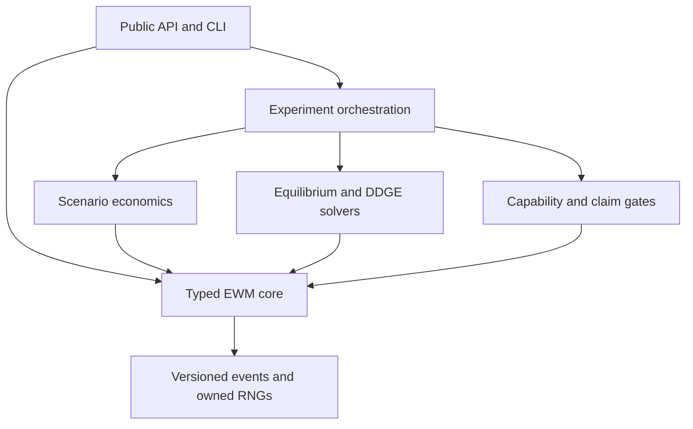

<div align="center">

# Economic World Model

**Model the economy after deployment, when predictions alter decisions and those decisions rewrite the next training set.**

[](https://github.com/ReverseZoom2151/economic-world-model/actions/workflows/ci.yml)
[](https://www.python.org/)
[](LICENSE)
[](#evidence-status)

</div>

Economic World Model is an open-source, executable adaptation of two research papers:

- Lin William Cong, [*Economic World Models and Data-Driven Generative Equilibria*](https://papers.ssrn.com/sol3/papers.cfm?abstract_id=6559940)
- Han et al., [*From Economic Agents to Agentic Economies: A Systems Blueprint for Economic World Models*](https://arxiv.org/abs/2608.06020v1)

Cong supplies the formal economic world and the equilibrium closure among behavior, endogenous
data, and learning. Han et al. supply the systems blueprint for executable agents, environments,
co-evolution, alignment, and evaluation. This package joins those ideas in a typed Python model with
reproducible experiments, numerical solvers, event provenance, and claim gates.

Version `0.1.0` is a synthetic research alpha. It is not an empirically calibrated economy, a
policy model, a trading or lending system, or a real-world economic twin.

[Quick start](#quick-start) | [Evidence status](#evidence-status) | [Architecture](#architecture) |
[Replication guide](docs/replication.md) | [Limitations](docs/limitations.md) |
[Paper traceability](docs/paper-traceability.md)

## The model

Economic predictions are often deployed into the system they describe. A forecast changes agent
actions, the actions change equilibrium outcomes, and the resulting observations become the next
training set. A valid solution must close the entire loop.

Let $\theta$ denote the learned components deployed under regime $i$. Holding $\theta$ fixed gives
an inner economic equilibrium with unique selector

$$
S_i(\theta)=\bigl(\pi_i(\theta),\mu_i(\theta)\bigr),
$$

where $\pi_i$ is the policy profile and $\mu_i$ is the belief profile. If $D$ generates data and
$L$ retrains the learned component, Cong's induced outer map is

$$
F_i(\theta)=L\!\left(D\!\left(S_i(\theta),\theta;i\right)\right).
$$

A Data-Driven Generative Equilibrium (DDGE) satisfies

$$
\theta^{\star}=F_i(\theta^{\star}),
\qquad
r_i(\theta)=\left\lVert F_i(\theta)-\theta\right\rVert_2.
$$

The package keeps four operations separate:

| Operation | Held fixed | Question answered |
|---|---|---|
| `rollout` | Declared policies and parameters, except within-world adaptation | What trajectory does the economy generate? |
| `solve_equilibrium` | Learned parameters and intervention | Which behavior and allocations satisfy the economic conditions? |
| `retrain` | One generated dataset and learning rule | Which parameter is deployed next? |
| `solve_ddge` | Nothing inside the declared behavior-data-learning loop | Which learned states are self-consistent? |

A converged rollout need not be an economic equilibrium. A fitted learner need not be a DDGE. A
small DDGE residual is a consistency diagnostic, not a welfare guarantee without Cong's additional
contraction and sensitivity assumptions.

Cong's full EWM definition contains state, action, and outcome spaces; interventions; agents;
information, policies, and beliefs; economic coherence conditions; learned kernels; and intervention
semantics. The [mathematical contract](docs/mathematical-contract.md) maps each block to code without
compressing it into an unreadable tuple.

## Evidence status

The repository uses four claim classes. `exact-replication` is reserved for paper equations,
parameters, and targets that the locked source specifies. `conformance` covers a system protocol or
invariant. `paper-inspired` identifies a paper template completed with package-authored choices.
`qualitative-reconstruction` identifies a mechanism whose published inputs are insufficient for an
exact numerical result.

| Area | Claim class | Current evidence |
|---|---|---|
| Cong EWM and DDGE objects | Source definition and conformance | Typed definitions, finite correspondence certificates, inner and outer residuals, theorem diagnostics |
| Cong Laboratory II | Exact replication | Scalar equations, displacement, pitchfork, damping, stability, and independent root checks |
| Cong Laboratory III | Exact replication with one disclosed package choice | Figure 4 parameters and slopes near $\{-0.795,0,+0.795\}$; the paper omits path damping |
| Cong Laboratory I | Qualitative reconstruction | Credit adoption, selective outcomes, retraining, oracle comparisons, and a machine-readable missing-input registry |
| Cong Appendix D | Paper-inspired | Household budget, firm problem, and market clearing from the paper; preferences, technology parameters, continuation closure, and finite distribution from this package |
| Han specification and runtime | Protocol conformance | Agent, environment, co-evolution, alignment, evaluation, and all seven logged runtime calls |
| Han capability ladder | L2 awarded | L3 to L6 substrates exist, but controlled or external evidence required for those awards is absent |
| Han evaluation stack | Protocol conformance | Agent, environment, co-evolution, alignment, and efficiency layers; missing measurements remain `not_measured` |

The conformance registry records section and page anchors, expected source hashes, code paths,
tests, status, and limitations for every declared item. The separate replication-target registry
classifies audited numerical facts as source-stated, derived, or package-authored. Run the
paper-level checks with:

```console
$ python scripts/run_conformance.py
...
"achieved_level": "L2"
"ddge_consistency": "supported"
"empirical_validity": "not_assessed"
```

The command runs the conformance suite and emits `ewm.conformance.v1` JSON. Its `paper_sources`
field is the declared lock map from `references/papers.toml`; it is not evidence that a PDF was read.
The separate `source_verification` field reports what was observed in the selected source directory,
alongside runtime versions, the package source fingerprint, seed sets, evidence gates, and unresolved
dependencies. Because the PDFs are ignored and are not present in ordinary CI checkouts, absence is
reported as `not_present` and does not fail the default command.

Verify locally supplied PDFs independently, or make them a required conformance gate, with:

```bash
python scripts/verify_sources.py --source-dir . --require-all
python scripts/run_conformance.py --source-dir . --require-sources
```

Both strict commands fail on a missing source as well as a hash, page-count, or PDF-structure
mismatch. Neither command downloads or redistributes a paper.

## Installation

Requirements:

- Python 3.11 or 3.12
- Linux, macOS, Windows, or WSL with a standard Python virtual environment
- No database, web server, model-provider account, or agent SDK

Install the alpha from a clone:

```bash
git clone https://github.com/ReverseZoom2151/economic-world-model.git
cd economic-world-model
python -m venv .venv
source .venv/bin/activate
python -m pip install --upgrade pip
python -m pip install -e .
```

On Windows PowerShell, activate with `.venv\Scripts\Activate.ps1`.

For tests, static checks, and builds, install `-e ".[dev]"` instead.

## Quick start

List the registered scenarios and experiments:

```console
$ ewm list
Scenarios:
  credit
  forecasting
  fx
  scalar
Experiments:
  credit.regimes
  forecasting.ddge
  fx.comparative_statics
  fx.rollout
```

Run a reproducible experiment bundle:

```bash
ewm describe forecasting.ddge
ewm run forecasting.ddge --preset smoke --seed 42 --output runs
```

Use the stable Python facade for an agent-economy rollout:

```python
import ewm

world = ewm.make("fx", preset="smoke", seed=42)
trajectory = ewm.rollout(world, periods=24)

print(trajectory.metrics)
```

Solve the disclosed production-economy instantiation:

```console
$ python examples/production.py
converged=True rental_rate=0.147500 wage=0.718658 clearing_norm=3.764e-14
primitive_source=package-authored; template_source=Cong Appendix D
```

The numerical result validates the declared finite instance. It is not a target reported by Cong and
does not prove Proposition D.1 for the general model.

## Research laboratories

| Laboratory | Main mechanism | Primary evidence |
|---|---|---|
| [Scalar DDGE](examples/scalar.py) | Linear behavior-response feedback with linear or saturating learning | Closed forms, independent bracketing, multiplicity and stability tests |
| [Self-fulfilling forecasting](examples/forecasting.py) | A deployed slope changes the process used to retrain that slope | Population and finite-sample maps, Figure 4 targets, basin and ACF checks |
| [Heterogeneous FX](examples/fx.py) | Households, firms, and banks clear a uniform-price batch market | Budget and inventory feasibility, conservation properties, paired intervention intervals |
| [AI-mediated credit](examples/credit.py) | Text polishing changes selection while repayment quality stays fixed | Five regimes, selective labels, oracle comparisons, source-target differences |
| [Competitive production](examples/production.py) | Households supply assets and labor to a decreasing-returns firm | Independent equilibrium solve, budget and first-order conditions, both market residuals |

The [experiment guide](docs/experiments.md) documents presets, metrics, seeds, artifact files, and
expected runtimes. The [replication guide](docs/replication.md) gives paper versions, exact commands,
and acceptance ranges.

## Han systems implementation

The package implements Han et al.'s compact lifecycle:

```text
reset -> run_agents -> step -> coevolve -> align -> evaluate -> log
```

Every call emits an immutable `ewm.event.v1` record with ordering and state-version provenance. The
runtime covers deterministic scheduling, action validation, clearing and settlement, controlled
component updates, bounded external-evidence correction, and read-only layered evaluation.

The optional capability substrates include:

- provider-neutral cognitive agents with explicit beliefs, bounded memory, tools, schemas, retries,
  atomic state commits, and decision provenance;
- content-addressed capability proposals with evaluation, safety gates, persistence, promotion, and
  rollback;
- governed institutional proposals with authority, constitutional checks, atomic application, audit,
  and rollback;
- timestamped external observations, discrepancy metrics, bounded corrections, restoration, and
  provenance.

The included cognitive backend and alignment source are deterministic offline fixtures. Their tests
establish protocol behavior, not L3 language-model fidelity or L6 real-world validity. See the
[capability matrix](docs/capability-matrix.md) for every award gate.

## Architecture

The package is a modular monolith. Shared infrastructure owns runtime semantics, numerical solution,
events, evidence, and artifacts. Scenario modules own economic assumptions.



This structure keeps scheduling, validation, random-number ownership, fixed-point search, logging,
and artifact identity out of individual laboratories. The audited
[dependency map](docs/architecture/ewm_foundations_dependency_map.md) records the enforced import
boundaries.

### Why no agent SDK dependency?

Economic agents require feasibility, accounting, market clearing, settlement, and equilibrium
contracts. LangChain, LangGraph, Mastra, Mesa, and similar packages do not define those economic
semantics. The core therefore uses small Python protocols.

Optional adapters can sit above the core when a study needs Mesa scheduling, a language-model
provider, or a multi-agent reinforcement-learning interface. The numerical economy remains usable
without any orchestration service.

## Reproducibility and artifacts

Each registered run writes an `ewm.run.v1` bundle containing configuration, metrics, traces, event
records, manifest data, and source/runtime identity. Equal source, parameters, and seeds produce the
same content hash. A changed seed or source fingerprint changes the run identity.

The project records:

- independent inner-equilibrium and outer-DDGE residuals;
- all distinct roots, failed starts, and initialization basins;
- damping and local Jacobian diagnostics;
- accounting, conservation, and clearing errors;
- package-authored primitives and missing paper inputs;
- measurement provenance, with absent evidence represented as missing rather than zero.

Synthetic tests establish conformance to these declared contracts. They do not establish behavioral,
empirical, causal, or policy validity.

## Documentation

| Document | Purpose |
|---|---|
| [Replication guide](docs/replication.md) | Source versions, commands, seeds, expected values, and claim boundaries |
| [Mathematical contract](docs/mathematical-contract.md) | Formal objects, equations, numerical scope, and evidence map |
| [Paper traceability](docs/paper-traceability.md) | Expected source locks, observed local verification, and section-to-code registry policy |
| [Capability matrix](docs/capability-matrix.md) | Han L1 to L6 evidence gates and the separate DDGE axis |
| [Experiment guide](docs/experiments.md) | Presets, CLI usage, artifacts, metrics, and interpretation |
| [Limitations](docs/limitations.md) | Missing evidence, omitted primitives, numerical scope, and non-goals |
| [Product validation](docs/product-validation.md) | Local clean-install, stress, performance, and claims-audit evidence |

## Development

Run the release gates from the repository root:

```bash
ruff check .
mypy src
coverage run -m pytest -q
coverage report
python -m build
python scripts/run_conformance.py
python scripts/scientific_stress.py --quick
```

When the ignored paper PDFs are available locally, add the strict source gate:

```bash
python scripts/verify_sources.py --source-dir . --require-all
python scripts/run_conformance.py --source-dir . --require-sources
```

The full stress and benchmark protocols take longer:

```bash
python scripts/scientific_stress.py
python scripts/benchmark_experiments.py
```

Public examples run without private imports:

```bash
python examples/scalar.py
python examples/forecasting.py
python examples/fx.py
python examples/credit.py
python examples/production.py
python examples/cognitive_agent.py
python examples/offline_alignment.py
python examples/extensions/cobweb.py
```

Focused contributions on economic semantics, numerical correctness, reproducibility, or testable
scenario design are welcome through [GitHub Issues](https://github.com/ReverseZoom2151/economic-world-model/issues).
Do not describe synthetic results as empirical evidence.

## Source credit

The formal ideas and paper-specific equations belong to the cited authors. This repository is an
independent implementation and is not an official release or endorsement by either paper's authors.
When using a paper-derived result, cite the corresponding source:

- Lin William Cong, *Economic World Models and Data-Driven Generative Equilibria*,
  [SSRN 6559940](https://papers.ssrn.com/sol3/papers.cfm?abstract_id=6559940).
- Jiale Han et al., *From Economic Agents to Agentic Economies: A Systems Blueprint for Economic
  World Models*, [arXiv:2608.06020v1](https://arxiv.org/abs/2608.06020v1).

The software is available under the [MIT License](LICENSE).

Documentation last reviewed: **2026-08-27**.
