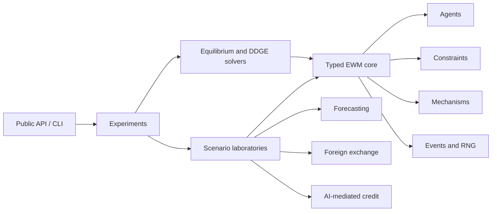

# Economic World Model

**Executable economic systems in which behavior changes data—and data changes the models that shape behavior.**

[](https://www.python.org/)
[](LICENSE)
[](#project-status)

`economic-world-model` is an open-source Python package for building transparent Economic World
Models (EWMs) and solving Data-Driven Generative Equilibria (DDGEs). It combines an executable,
typed agent economy with numerical tools for the feedback loop between economic behavior,
endogenously generated data, and learned models.

The project operationalizes two complementary research programs:

- Cong's equilibrium formulation, particularly the behavior–data–learning closure represented by
  DDGE.
- Han et al.'s systems blueprint for agents, environments, institutions, co-evolution, and
  evaluation in an EWM.

The first release is a **synthetic research laboratory**, not an empirically calibrated economy, a
policy oracle, a trading or lending system, or a claim to a real-world economic digital twin.

## Why an economic world model?

Most predictive pipelines treat their data-generating process as external. Economic models often
cannot: a deployed forecast changes decisions; those decisions change prices, allocations, and
observations; retraining on those observations changes the next deployed forecast.

For an intervention or regime `i`, let the fixed-environment economic solution under learned
parameters `theta` be `E_i(theta)`. Let `D_i` generate observations from that economy and let `L_i`
retrain the learned component. The outer update is

```text
F_i(theta) = L_i(D_i(E_i(theta), theta)).
```

A Data-Driven Generative Equilibrium is a self-consistent learned state:

```text
theta* = F_i(theta*).
```

The package makes this closure executable while preserving the distinction among simulation,
economic equilibrium, retraining, and full DDGE solution.

## Project status

The repository is under active development toward `0.1.0`. The numerical kernel is implemented;
the economic laboratories and stable top-level API are the next vertical slices.

| Capability | Status | What is available |
|---|---|---|
| Typed records and protocols | Implemented | Actions, transitions, generated datasets, metadata, equilibrium and DDGE results |
| Economic-world runtime | Implemented | Deterministic agent order, owned RNGs, constraints before mechanisms, immutable transitions, events |
| Equilibrium and DDGE numerics | Implemented | Root solving, damping, multistart multiplicity discovery, residual/Jacobian/stability diagnostics |
| Self-fulfilling forecasting laboratory | In development | Mathematical acceptance case for learning-generated multiplicity |
| Multi-agent FX laboratory | Planned for `0.1.0` | Heterogeneous agents, balance constraints, batch clearing, conservation diagnostics |
| AI-mediated credit laboratory | Planned for `0.1.0` | Endogenous adoption, selective labels, frozen and retrained counterfactuals |
| Experiment artifacts and stable facade | Planned for `0.1.0` | Reproducible manifests, tables, traces, documented `ewm` entry points |

No dashboard, web application, database, distributed runtime, external economic dataset, or LLM
dependency is part of the initial model package.

## The four operations

These operations are intentionally separate contracts:

| Operation | Held fixed | What it answers |
|---|---|---|
| `rollout` | Policies and learned parameters, except declared within-world adaptation | What trajectory does this economy generate? |
| `solve_equilibrium` | Learned parameters and intervention | Which behavior and allocation satisfy the economic conditions? |
| `retrain` | One generated dataset and learning rule | What is the next learned parameter? |
| `solve_ddge` | Nothing inside the declared behavior–data–learning loop | Which learned states are self-consistent? |

A long or converged rollout is not automatically an equilibrium. A well-fitted learner is not
automatically a DDGE. A small DDGE residual is not automatically a small welfare error.

## Architecture

The package is a modular monolith. Scenario modules provide economics; shared infrastructure owns
runtime semantics, numerical solution, provenance, and experiment execution.



Dependency direction is one-way:

```text
API/CLI -> experiments -> scenarios -> core
                   |          |
                   +------> equilibrium -> core
```

This prevents each laboratory from reimplementing scheduling, action validation, random-number
ownership, fixed-point search, logs, or artifacts. Explore the complete dependency map as
[Markdown](docs/architecture/ewm_foundations_dependency_map.md) or
[interactive HTML](docs/architecture/ewm_foundations_dependency_map.html).

## Installation

The package requires Python 3.11 or newer. During alpha development, install it from a clone:

```bash
git clone https://github.com/ReverseZoom2151/economic-world-model.git
cd economic-world-model
python -m venv .venv
source .venv/bin/activate
python -m pip install --upgrade pip
python -m pip install -e ".[dev]"
```

On Windows PowerShell, activate the environment with `.venv\Scripts\Activate.ps1`.

## Minimal examples

### Run an economic-world transition

The current low-level API is deliberately small and framework-independent:

```python
from typing import Any

import numpy as np

from ewm.core import Action, ConstraintSet, FunctionalAgent, FunctionalMechanism
from ewm.core.world import World


def consume(_state: Any, _rng: np.random.Generator) -> Action:
    return Action("household-1", "consume", {"quantity": 1.0})


def clear(
    state: dict[str, float],
    actions: tuple[Action, ...],
    _rng: np.random.Generator,
) -> tuple[dict[str, float], dict[str, float]]:
    cleared = sum(float(action.values["quantity"]) for action in actions)
    state["output"] += cleared
    return state, {"cleared": cleared}


world = World(
    initial_state=lambda _rng: {"output": 0.0},
    agents=(FunctionalAgent("household-1", consume),),
    mechanism=FunctionalMechanism(clear),
    constraints=ConstraintSet(),
)
state = world.reset(seed=42)
transition = world.step(state, world.run_agents(state))

assert transition.state["output"] == 1.0
assert transition.diagnostics["violation_count"] == 0
```

The runtime sorts agents deterministically, gives stochastic components an owned NumPy generator,
checks constraints before mechanisms, and returns an immutable transition.

### Find a fixed point and inspect stability

```python
import numpy as np

from ewm.equilibrium import FixedPointConfig, iterate_fixed_point


def update(theta: np.ndarray) -> np.ndarray:
    return np.array([1.0 + 0.5 * theta[0]])


point = iterate_fixed_point(
    update,
    initial_theta=np.array([0.0]),
    config=FixedPointConfig(tolerance=1e-10),
)

assert point.converged
assert np.allclose(point.theta, [2.0])
assert point.stable is True
assert np.isclose(point.spectral_radius, 0.5, atol=1e-6)
```

For models with possible multiplicity, `solve_multistart` retains distinct roots and records the
initializations associated with each basin instead of silently choosing one.

## Initial research laboratories

### 1. Self-fulfilling forecasting

A deployed forecasting slope induces actions and a nonlinear aggregate process; data generated by
that process are used to re-estimate the slope. This laboratory tests uniqueness under weak
feedback, pitchfork multiplicity after the critical value, local stability, basin dependence,
finite-sample escape from an unstable equilibrium, and the limits of within-regime predictive fit.

It is the mathematical acceptance test for the generic DDGE solver.

### 2. Heterogeneous foreign exchange

Households trade speculatively under bounded-memory beliefs, firms meet external-currency needs,
and banks supply liquidity subject to inventory and exposure limits. A uniform-price batch mechanism
will validate orders, clear compatible demand and supply, and settle cash against foreign currency.

The scientific focus is feasibility, accounting conservation, clearing residuals, endogenous belief
adaptation, and prespecified comparative statics—not empirical exchange-rate forecasting.

### 3. AI-mediated credit

Borrowers differ in latent repayment quality and observable features. A generative-AI intervention
can polish text features without changing repayment quality; borrowers adopt when the decision
benefit covers their cost. The lender retrains on endogenous—and sometimes selectively observed—
repayment outcomes.

The laboratory will compare a no-AI baseline, frozen-model counterfactual, selective-observation
DDGE, full-information DDGE, and omniscient quality oracle. It studies sign reversals, feedback
repair, misspecification, and residual diagnostics under explicit synthetic assumptions.

## Scientific standards

Reproducibility and claim discipline are part of the architecture:

- Every stochastic run owns its RNG and records its seed and configuration.
- Inner-equilibrium and outer-DDGE residuals remain separate.
- Multiplicity includes distinct roots, failed starts, and basin provenance.
- Damping is a numerical choice, not proof of economic stability.
- Accounting and market-clearing errors are explicit diagnostics.
- Mathematical claims require analytical or special-case checks plus numerical or property checks.
- Stochastic comparisons use common random numbers, effect magnitudes, and uncertainty intervals.
- Failed hypotheses and sensitivity regions are retained rather than optimized away.

Synthetic replication establishes internal validity for the implemented mechanism. It does not, by
itself, establish external or policy validity.

## Why there is no agent SDK dependency

The EWM kernel uses Python protocols rather than LangChain, LangGraph, Mastra, Mesa, or another
agent framework. Economic agents need explicit feasibility, clearing, settlement, accounting, and
equilibrium semantics; a general LLM workflow SDK does not supply those contracts.

The protocol boundary permits optional adapters later:

- **Mesa** for alternative agent-based scheduling, batch running, and data collection;
- **PettingZoo** when a world becomes a multi-agent reinforcement-learning environment; and
- **LangGraph or direct model-provider adapters** for optional LLM-backed cognitive policies.

Adapters may depend on the EWM core. The EWM core will not depend on an adapter, so the numerical
economy remains reproducible and usable without an LLM or orchestration service.

## Repository guide

```text
src/ewm/core/          typed records, protocols, runtime, agents, constraints, mechanisms
src/ewm/equilibrium/   equilibrium and DDGE solvers, damping, diagnostics
tests/unit/            deterministic unit and mathematical tests
docs/plans/            approved design and implementation plan
docs/architecture/     audited dependency map
```

Read the [approved design](docs/plans/2026-08-27-ewm-prototype-design.md) for the full model
contract, claim boundaries, economic primitives, and adversarial review. The staged build sequence is
in the [implementation plan](docs/plans/2026-08-27-ewm-prototype-implementation.md).

## Development

Run the verification suite with:

```bash
python -m pytest -q
ruff check src tests
mypy src
```

Contributions are welcome once the initial vertical slices stabilize. Until then, focused issues on
economic semantics, numerical correctness, reproducibility, or testable scenario design are
especially useful. Please do not describe synthetic results as empirical evidence.

## References

- Lin William Cong, *Economic World Models and Data-Driven Generative Equilibria*, available from
  [SSRN](https://papers.ssrn.com/sol3/papers.cfm?abstract_id=6559940).
- Han et al., *From Economic Agents to Agentic Economies: A Systems Blueprint for Economic World
  Models*, available from [arXiv](https://arxiv.org/abs/2608.06020).

This software is an independent open-source implementation and is not an official release by the
papers' authors.

## License

Released under the [MIT License](LICENSE).

---

Documentation last reviewed: **2026-08-27**.
