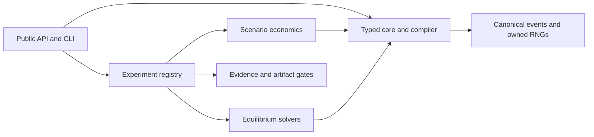

<h1 align="center">Economic World Model</h1>

<p align="center">
<a href="https://github.com/ReverseZoom2151/economic-world-model/actions/workflows/ci.yml"></a>
<a href="https://github.com/ReverseZoom2151/economic-world-model/actions/workflows/security.yml"></a>
<a href="https://www.python.org/"></a>
<a href="LICENSE"></a>
</p>

<p align="center">
Build and solve economic worlds where agents, markets, data, and learned models co-evolve.
</p>

<p align="center">
<a href="https://papers.ssrn.com/sol3/papers.cfm?abstract_id=6559940">Cong: Economic World Models and Data-Driven Generative Equilibria</a>
|
<a href="https://arxiv.org/abs/2608.06020v1">Han et al.: From Economic Agents to Agentic Economies: A Systems Blueprint for Economic World Models</a>
</p>

Economic World Model is an auditable research implementation of selected definitions, protocols,
and numerical targets from the two papers. Cong supplies the formal economy and the fixed point that
closes behavior, generated data, and retraining. Han et al. supply the executable agent-world
interfaces, capability ladder, and evaluation layers.

Release 0.2.0 is a synthetic research alpha. It is suitable for studying declared mechanisms and
testing implementation contracts. It is not an empirically calibrated economy, a policy model, or a
deployment system.

[Quick start](#quick-start) | [Mathematical core](#mathematical-core) |
[Evidence](#evidence) | [Architecture](#architecture) | [Limitations](#limitations) |
[Documentation](#documentation)

## Quick start

Economic World Model supports Python 3.11 and 3.12 on Linux, macOS, Windows, and WSL. A local
clone needs no database or model-provider account.

```bash
git clone https://github.com/ReverseZoom2151/economic-world-model.git
cd economic-world-model
python -m venv .venv
source .venv/bin/activate
python -m pip install --upgrade pip
python -m pip install -e .
ewm list
```

Windows PowerShell uses `.venv\Scripts\Activate.ps1` for activation. Install `-e ".[dev]"` to run
the tests and release checks.

Create a sealed FX run, then verify and replay it:

```bash
ewm run fx.rollout --preset smoke --seed 42 --output runs
ewm verify-run runs/<run_hash>
ewm replay-run runs/<run_hash>
```

The `run` command prints the concrete run directory. `verify-run` checks sealed `ewm.run.v2`
payloads and can inspect legacy `ewm.run.v1` bundles without modifying them. `replay-run` currently
requires a sealed v2 `fx.rollout` run and reconstructs its compiled world deterministically. Other
registered experiments can still be run and verified.

The public Python facade exposes the same scenario registry:

```python
import ewm

scenario = ewm.make("fx", preset="smoke", seed=42)
trajectory = ewm.rollout(scenario, periods=24)

print(trajectory.metrics)
```

The CLI provides four experiments:

```bash
ewm describe forecasting.ddge
ewm run forecasting.ddge --preset smoke --seed 42 --output runs
ewm run fx.comparative_statics --preset smoke --seed 42 --output runs
ewm run credit.regimes --preset smoke --seed 42 --output runs
```

Research presets increase numerical scale. They do not add empirical validity.

## Mathematical core

Cong's Definition 2.6 groups an Economic World Model into named blocks:

| Block | Paper objects | Package role |
|---|---|---|
| Economic spaces | $\mathcal{S},\mathcal{A},\mathcal{Y},\mathcal{I}$ | States, actions, outcomes, and regimes |
| Agent population | N agents; notation below | Information, admissible policies, and beliefs for each agent |
| Economic coherence | $\mathcal{C}$ | Hard equalities, hard inequalities, and soft diagnostics |
| Learned system | $T_\theta,O_\theta$ | Transition and observation kernels |
| Intervention semantics | $\Psi$ | Declared component changes under each regime |

```math
\lbrace(\mathcal{I}_{t}^{n},\Pi^{n},\mu_{t}^{n})\rbrace_{n=1}^{N}.
```

For learned components $\theta$ and regime $i$, the inner correspondence holds the learned system
fixed:

$$
E_i(\theta)=\lbrace(\pi,\mu)\mid \pi\text{ is behaviorally optimal or admissible, and }
\mu\text{ is belief-consistent under }(\theta,i)\rbrace.
$$

These are the two inner conditions. If $E_i(\theta)$ is a singleton, write its selector as
$S_i(\theta)=(\pi_i(\theta),\mu_i(\theta))$. Data generation $D$ and learning $L$ then induce the
outer map

$$
F_i(\theta)=L\!\left(D\!\left(S_i(\theta),\theta;i\right)\right).
$$

A Data-Driven Generative Equilibrium (DDGE) closes the outer loop:

$$
\theta^{\star}=F_i(\theta^{\star}).
$$

The full DDGE also requires the selected policy and beliefs to satisfy the inner conditions. A small
outer residual does not establish behavioral optimality, welfare accuracy, uniqueness, or empirical
validity.

The package keeps execution modes distinct:

| Operation | Contract |
|---|---|
| `rollout` | Generate a trajectory under declared policies and within-world adaptation |
| `solve_equilibrium` | Solve the inner economic residual while holding $\theta$ and $i$ fixed |
| `retrain` | Apply one generated-data learning update |
| `solve_ddge` | Search declared initializations for outer fixed points |

## Evidence

Public claims use four boundaries. `exact-replication` requires source equations, source parameters,
source targets, and an independent numerical check. `conformance` tests a definition, protocol, or
invariant. `paper-inspired` marks source templates completed with package choices.
`qualitative-reconstruction` marks a mechanism whose published inputs do not identify the numerical
result.

| Area | Current evidence | Boundary |
|---|---|---|
| Cong Laboratory II | Direct paper equation, analytical root-count argument, package-import-free bracketing, and iterative solver agreement | Exact replication for the registered scalar targets |
| Cong Laboratory III population | Package-import-free stationary-kernel and zero-intercept OLS oracle cross-checks the roots near $\{-0.795,0,+0.795\}$ | Exact replication of the population targets only |
| Cong Laboratory III finite sample | Source-specified 4,000 observations with package-authored damping | Paper-inspired path, with no claim of exact path replication |
| Cong Laboratory I credit | Mechanism reconstruction plus a prospectively locked local quick protocol | Exact replication is blocked by missing author primitives. All four quick seeds breach the locked solver tolerance, so `analysis_valid=false` and the result is diagnostic only |
| Cong Appendix D | A package-import-free objective optimizer and direct market-clearing solve cross-check the disclosed finite instance | Paper-inspired package instance, not a paper target or general existence proof |
| Compiled FX world | Compiled execution preserves the characterized pre-compiler outputs and adds canonical events, accounting checks, and deterministic replay | Synthetic runtime migration and mechanism conformance |
| Han L1 and L2 | A hashed two-arm, two-seed compiled FX protocol observes execution, endogenous outcomes, invariants, adaptive state, and persistence | L2 awarded as synthetic systems conformance, not behavioral or empirical validation |
| Han L3 through L6 | A versioned harness records one local readiness result for each of 16 official requirements | All 16 remain blocked readiness observations; zero higher-level awards |
| Run artifacts | Canonical v2 identity, checksums for every payload, collision checks, and fail-closed verification | Package engineering evidence, not paper correspondence |

The code-independent oracle modules under `tests/oracles/` cannot import `ewm`; an AST test enforces
that boundary. The forecasting oracle covers the population stationary-law map only. The production
oracle checks a package-authored instance. Neither extends its evidence to a finite-sample path or a
general theorem.

Run the paper and evidence checks with:

```bash
python scripts/run_conformance.py
python scripts/verify_sources.py --source-dir . --require-all
python scripts/run_conformance.py --source-dir . --require-sources
```

The strict source commands require both ignored local PDFs. The default conformance command records
missing PDFs as `not_present`; it does not claim to have read files that were absent.

The locked credit protocol is intentionally left at its original thresholds:

```bash
ewm-run-protocol --quick
```

Its current nonzero exit status preserves the prespecified failure. Outcome summaries remain useful
for diagnosis, but they authorize no inference or scientific claim.

## Architecture

The repository is a modular monolith. Scenario modules own economic assumptions. Shared layers own
runtime contracts, fixed-point search, artifacts, and evidence boundaries.



The compiled FX path uses the same economic mechanism as the direct simulation while adding strict
action contracts, state codecs, event-chain provenance, rollback-safe randomness, and replay. The
[audited dependency map](docs/architecture/ewm_foundations_dependency_map.md) records enforced
one-way imports.

Replayable runs use full provenance by default. Replicated comparative-statistics runs use summary
provenance because their inner event streams are discarded; they still execute through the same
compiler, action validation, scheduler, constraints, and market mechanism. Summary runs retain a
canonical event chain but intentionally cannot be exported for replay.

## Limitations

- The bundled laboratories use synthetic populations and package-authored assumptions. They do not
  estimate effects in an observed economy.
- The generic DDGE solver searches a single-valued outer map from declared starts. It does not prove
  completeness outside the search region or solve a general Kakutani correspondence.
- Restricted affine and polyhedral certificates validate declared finite assumptions and residuals.
  General existence and welfare claims still require model-specific proofs.
- The highest awarded Han capability is L2 for the compiled FX validation. Fixture-backed cognition,
  evolution, institutions, and alignment do not award L3, L4, L5, or L6.
- `replay-run` currently supports sealed FX rollout artifacts only. Legacy v1 bundles are verified in
  read-only compatibility mode and cannot be replayed under the v2 contract.
- Full replay provenance has a measurable runtime cost. On the recorded local 0.2 audit,
  `fx.rollout` research runs had a 4.22-second p50 and replicated FX research comparisons had a
  94.93-second p50. These are research baselines, not service-level objectives.
- Credit, FX, forecasting, and production outputs must not guide lending, trading, employment,
  pricing, regulatory, or public-policy decisions.

See [Limitations and non-goals](docs/limitations.md) for the complete boundary.

## Documentation

| Document | Use it for |
|---|---|
| [Experiment guide](docs/experiments.md) | Registry, CLI, v2 artifacts, verification, replay, and metric interpretation |
| [Mathematical contract](docs/mathematical-contract.md) | Formal objects, theorem obligations, equations, and scenario mechanics |
| [Replication guide](docs/replication.md) | Source locks, claim classes, exact commands, targets, and tolerances |
| [Paper traceability](docs/paper-traceability.md) | Source identity, registry policy, code-independent oracles, and evidence gates |
| [Capability matrix](docs/capability-matrix.md) | Han L1 to L6 requirements and the separate DDGE axis |
| [Product validation](docs/product-validation.md) | Historical benchmarks plus the current 0.2.0 audit |
| [Limitations and non-goals](docs/limitations.md) | Numerical, empirical, runtime, and deployment boundaries |
| [Ontology repository study](docs/ontology-repository-study.md) | Eight-repository architecture, provenance, verifier, and licensing review |

The formal ideas and paper-specific equations belong to the cited authors. This repository is an
independent implementation and is not an official release or endorsement by either paper's authors.
Citation metadata is in [`CITATION.cff`](CITATION.cff).

Documentation last reviewed: 2026-08-28.
