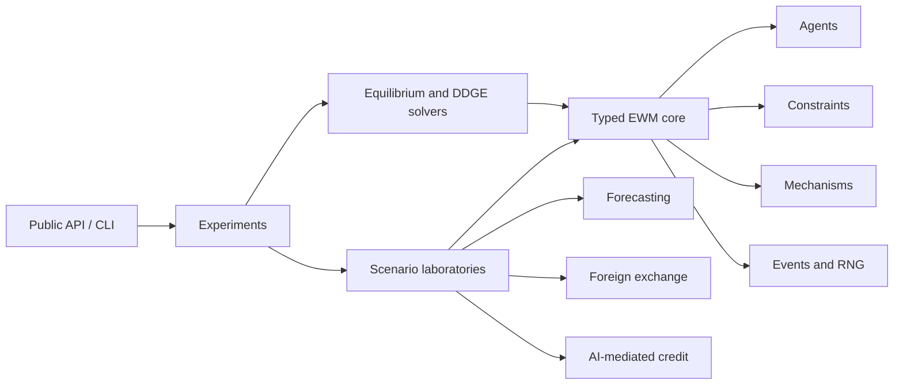

<div align="center">
  <h1>Economic World Model</h1>
  <p><strong>Build and solve economies where agents, markets, data, and learned models co-evolve.</strong></p>
  <p>
    <a href="https://github.com/ReverseZoom2151/economic-world-model/actions/workflows/ci.yml"></a>
    <a href="https://www.python.org/"></a>
    <a href="LICENSE"></a>
    <a href="#project-status"></a>
  </p>
</div>

**Economic World Model** is an open-source research implementation of executable economies whose
behavior, generated data, and learned models evolve together. It combines a typed agent economy
with numerical methods for Economic World Models (EWMs) and Data-Driven Generative Equilibria
(DDGEs). The repository is distributed as a Python package so researchers can inspect, test, and
extend every mechanism.

The project brings together two complementary papers:

- Lin William Cong, [*Economic World Models and Data-Driven Generative Equilibria*](https://papers.ssrn.com/sol3/papers.cfm?abstract_id=6559940), which formalizes the equilibrium closure among behavior, endogenous data, and learning.
- Han et al., [*From Economic Agents to Agentic Economies: A Systems Blueprint for Economic World Models*](https://arxiv.org/abs/2608.06020), which specifies the systems architecture for agents, environments, institutions, co-evolution, and evaluation.

The first release is a **synthetic research laboratory**, not an empirically calibrated economy, a
policy oracle, a trading or lending system, or a claim to a real-world economic digital twin.

## Why an economic world model?

Most predictive pipelines treat their data-generating process as external. Economic models often
cannot: a deployed forecast changes decisions; those decisions change prices, allocations, and
observations; retraining on those observations changes the next deployed forecast.

Cong's Definition 2.6 names the complete economic world $\mathcal{W}$. Rather than reproducing its
long tuple as a comma-separated display, the exact blocks are grouped here:

| Block in Cong's definition | Meaning |
|---|---|
| $\mathcal{S}$, $\mathcal{A}$, $\mathcal{Y}$ | State, action, and outcome spaces |
| $\mathcal{I}$ | Interventions, policies, technologies, or institutional regimes |
| $N$ | Number of agents |
| $\mathcal{I}_t^n$ | Information available to agent $n$ at time $t$ |
| $\Pi^n$ | Admissible policies for agent $n$ |
| $\mu_t^n$ | Agent $n$'s belief representation at time $t$ |
| $\mathcal{C}$ | Hard and soft economic coherence conditions |
| $T_{\theta}$, $O_{\theta}$ | Learned transition and observation kernels |
| $\Psi$ | Intervention semantics: which parts of the world a regime changes |

Han et al. supply the complementary systems organization: economic agents, an executable economic
environment, agent-environment co-evolution, real-time alignment, and evaluation. The DDGE
notation below comes specifically from Cong's Sections 3.2 and 3.3.

Let $\pi$ be the profile of agent policies, $\mu$ the profile of beliefs, and $\theta$ the learned
components deployed in the world. Holding $\theta$ fixed gives the inner equilibrium set
$E_i(\theta)$. When that equilibrium is unique, Cong writes its selector as

$$
S_i(\theta)=(\pi_i(\theta),\mu_i(\theta)).
$$

The generated-data shorthand and induced outer learning map are

$$
D(S_i(\theta),\theta;i)
\equiv
D(\pi_i(\theta),\mu_i(\theta),\theta;i),
$$

$$
F_i(\theta)=L(D(S_i(\theta),\theta;i)).
$$

The full DDGE definition also requires behavioral optimality and belief consistency. Its learning
consistency condition is

$$
\theta^{\star}=L(D(\pi^{\star},\mu^{\star},\theta^{\star};i)).
$$

Under the unique selector above, version `0.1` searches for the equivalent outer fixed point and
reports Cong's frozen-equilibrium residual:

$$
\theta^{\star}=F_i(\theta^{\star}),
\qquad
r_i(\theta)=\lVert F_i(\theta)-\theta\rVert.
$$

The reported residual $r_i(\theta)$ measures model-environment inconsistency. It does not become a
welfare bound unless the required contraction and sensitivity conditions are also established. The
package makes this closure executable while keeping simulation, economic equilibrium, retraining,
and full DDGE solution distinct.

## Project status

Version `0.1.0` is a research alpha. The shared numerical kernel, all three laboratories,
reproducible artifact layer, public Python facade, and non-interactive CLI are implemented.

| Capability | Status | What is available |
|---|---|---|
| Typed records and protocols | Implemented | Actions, transitions, generated datasets, metadata, equilibrium and DDGE results |
| Economic-world runtime | Implemented | Deterministic agent order, owned RNGs, constraints before mechanisms, immutable transitions, events |
| Equilibrium and DDGE numerics | Implemented | Root solving, damping, multistart multiplicity discovery, residual/Jacobian/stability diagnostics |
| Self-fulfilling forecasting laboratory | Implemented | Population and finite-sample maps, multiplicity, basin/stability tests, independent oracle report |
| Multi-agent FX laboratory | Implemented | Symbolic households/firms/bank, aggregate balance reservation, uniform-price pro-rata clearing, adaptive beliefs, conservation properties, replicated paired comparisons |
| AI-mediated credit laboratory | Implemented | Endogenous decision-flip adoption, common potential outcomes, selective/full-information DDGE, frozen and omniscient counterfactuals, sensitivity boundaries |
| Experiment artifacts and stable facade | Implemented | Reproducible manifests, tables, traces, `ewm` Python entry points, and CLI |

No dashboard, web application, database, distributed runtime, external economic dataset, or LLM
dependency is part of the initial model package.

## The four operations

These operations are intentionally separate contracts:

| Operation | Held fixed | What it answers |
|---|---|---|
| `rollout` | Policies and learned parameters, except declared within-world adaptation | What trajectory does this economy generate? |
| `solve_equilibrium` | Learned parameters and intervention | Which behavior and allocation satisfy the economic conditions? |
| `retrain` | One generated dataset and learning rule | What is the next learned parameter? |
| `solve_ddge` | Nothing inside the declared behavior, data, and learning loop | Which learned states are self-consistent? |

A long or converged rollout is not automatically an equilibrium. A well-fitted learner is not
automatically a DDGE. A small DDGE residual is not automatically a small welfare error.

## Architecture

The package is a modular monolith. Scenario modules provide economics; shared infrastructure owns
runtime semantics, numerical solution, provenance, and experiment execution.



Dependency direction is one-way:

```text
API/CLI -> experiments -> scenarios -> core
                   |          |
                   +------> equilibrium -> core
```

This prevents each laboratory from reimplementing scheduling, action validation, random-number
ownership, fixed-point search, logs, or artifacts. Explore the complete dependency map as
[Markdown](docs/architecture/ewm_foundations_dependency_map.md) or
[interactive HTML](docs/architecture/ewm_foundations_dependency_map.html).

## Installation

The package requires Python 3.11 or newer. During alpha development, install it from a clone:

```bash
git clone https://github.com/ReverseZoom2151/economic-world-model.git
cd economic-world-model
python -m venv .venv
source .venv/bin/activate
python -m pip install --upgrade pip
python -m pip install -e ".[dev]"
```

On Windows PowerShell, activate the environment with `.venv\Scripts\Activate.ps1`.

## Quick start

Discover and run the registered experiments:

```bash
ewm list
ewm describe forecasting.ddge
ewm run forecasting.ddge --preset smoke --seed 42 --output runs
```

Use the stable Python facade for a rollout:

```python
import ewm

world = ewm.make("fx", preset="smoke", seed=42)
trajectory = ewm.rollout(world, periods=24)

print(trajectory.metrics)
```

Complete programs for [forecasting](examples/forecasting.py), [FX](examples/fx.py), and
[AI-mediated credit](examples/credit.py) execute in CI. See the
[experiment guide](docs/experiments.md) for presets, commands, metrics, and artifact schemas.

## Core extension examples

### Run an economic-world transition

The current low-level API is deliberately small and framework-independent:

```python
from typing import Any

import numpy as np

from ewm.core import Action, ConstraintSet, FunctionalAgent, FunctionalMechanism
from ewm.core.world import World


def consume(_state: Any, _rng: np.random.Generator) -> Action:
    return Action("household-1", "consume", {"quantity": 1.0})


def clear(
    state: dict[str, float],
    actions: tuple[Action, ...],
    _rng: np.random.Generator,
) -> tuple[dict[str, float], dict[str, float]]:
    cleared = sum(float(action.values["quantity"]) for action in actions)
    state["output"] += cleared
    return state, {"cleared": cleared}


world = World(
    initial_state=lambda _rng: {"output": 0.0},
    agents=(FunctionalAgent("household-1", consume),),
    mechanism=FunctionalMechanism(clear),
    constraints=ConstraintSet(),
)
state = world.reset(seed=42)
transition = world.step(state, world.run_agents(state))

assert transition.state["output"] == 1.0
assert transition.diagnostics["violation_count"] == 0
```

The runtime sorts agents deterministically, gives stochastic components an owned NumPy generator,
checks constraints before mechanisms, and returns an immutable transition.

### Find a fixed point and inspect stability

```python
import numpy as np

from ewm.equilibrium import FixedPointConfig, iterate_fixed_point


def update(theta: np.ndarray) -> np.ndarray:
    return np.array([1.0 + 0.5 * theta[0]])


point = iterate_fixed_point(
    update,
    initial_theta=np.array([0.0]),
    config=FixedPointConfig(tolerance=1e-10),
)

assert point.converged
assert np.allclose(point.theta, [2.0])
assert point.stable is True
assert np.isclose(point.spectral_radius, 0.5, atol=1e-6)
```

For models with possible multiplicity, `solve_multistart` retains distinct roots and records the
initializations associated with each basin instead of silently choosing one.

## Initial research laboratories

### 1. Self-fulfilling forecasting

A deployed forecasting slope induces actions and a nonlinear aggregate process; data generated by
that process are used to re-estimate the slope. This laboratory tests uniqueness under weak
feedback, pitchfork multiplicity after the critical value, local stability, basin dependence,
finite-sample escape from an unstable equilibrium, and the limits of within-regime predictive fit.

It is the mathematical acceptance test for the generic DDGE solver.

### 2. Heterogeneous foreign exchange

Households trade speculatively under bounded-memory beliefs, firms meet external-currency needs,
and banks supply liquidity subject to inventory and exposure limits. A uniform-price batch mechanism
validates orders, clears compatible demand and supply, and settles cash against foreign currency.

The scientific focus is feasibility, accounting conservation, clearing residuals, endogenous belief
adaptation, and prespecified comparative statics. Paired simulations reuse random-number streams to
estimate intervention effects and Monte Carlo intervals. It is not an empirical exchange-rate
forecaster.

### 3. AI-mediated credit

Borrowers differ in latent repayment quality and observable features. A generative-AI intervention
can polish text features without changing repayment quality; borrowers adopt when the decision
benefit covers their cost. The lender retrains on endogenous repayment outcomes that are selectively
observed in some regimes.

The laboratory compares a no-AI baseline, frozen-model counterfactual, selective-observation DDGE,
full-information DDGE, and omniscient quality oracle. It studies sign reversals, feedback repair,
misspecification, and residual diagnostics under explicit synthetic assumptions. Finite binary
selection can produce a small discontinuity cycle, which is reported as a residual floor rather than
misrepresented as exact convergence.

## Scientific standards

Reproducibility and claim discipline are part of the architecture:

- Every stochastic run owns its RNG and records its seed and configuration.
- Inner-equilibrium and outer-DDGE residuals remain separate.
- Multiplicity includes distinct roots, failed starts, and basin provenance.
- Damping is a numerical choice, not proof of economic stability.
- Accounting and market-clearing errors are explicit diagnostics.
- Mathematical claims require analytical or special-case checks plus numerical or property checks.
- Stochastic comparisons use common random numbers, effect magnitudes, and uncertainty intervals.
- Failed hypotheses and sensitivity regions are retained rather than optimized away.

Synthetic replication establishes internal validity for the implemented mechanism. It does not, by
itself, establish external or policy validity.

## Why there is no agent SDK dependency

The EWM kernel uses Python protocols rather than LangChain, LangGraph, Mastra, Mesa, or another
agent framework. Economic agents need explicit feasibility, clearing, settlement, accounting, and
equilibrium semantics; a general LLM workflow SDK does not supply those contracts.

The protocol boundary permits optional adapters later:

- **Mesa** for alternative agent-based scheduling, batch running, and data collection;
- **PettingZoo** when a world becomes a multi-agent reinforcement-learning environment; and
- **LangGraph or direct model-provider adapters** for optional LLM-backed cognitive policies.

Adapters may depend on the EWM core. The EWM core will not depend on an adapter, so the numerical
economy remains reproducible and usable without an LLM or orchestration service.

## Repository guide

```text
src/ewm/core/          typed records, protocols, runtime, agents, constraints, mechanisms
src/ewm/equilibrium/   equilibrium and DDGE solvers, damping, diagnostics
src/ewm/experiments/   registry, orchestration, metrics, statistics, and artifacts
src/ewm/scenarios/     forecasting, heterogeneous FX, and AI-credit laboratories
examples/              executable public API examples
tests/unit/            deterministic unit and mathematical tests
tests/integration/     facade, CLI, and artifact reproducibility tests
docs/plans/            approved design and implementation plan
docs/architecture/     audited dependency map
```

Start with the [mathematical contract](docs/mathematical-contract.md),
[experiment guide](docs/experiments.md), and [capability matrix](docs/capability-matrix.md). The
[approved design](docs/plans/2026-08-27-ewm-prototype-design.md) records the full model contract,
claim boundaries, economic primitives, and adversarial review. The staged build sequence is in the
[implementation plan](docs/plans/2026-08-27-ewm-prototype-implementation.md).

## Development

Run the verification suite with:

```bash
ruff check .
mypy src
coverage run -m pytest -q
coverage report
python -m build
python examples/forecasting.py
python examples/fx.py
python examples/credit.py
```

Focused issues and contributions on economic semantics, numerical correctness, reproducibility, or
testable scenario design are welcome. Please do not describe synthetic results as empirical evidence.

## References

- Lin William Cong, *Economic World Models and Data-Driven Generative Equilibria*, available from
  [SSRN](https://papers.ssrn.com/sol3/papers.cfm?abstract_id=6559940).
- Han et al., *From Economic Agents to Agentic Economies: A Systems Blueprint for Economic World
  Models*, available from [arXiv](https://arxiv.org/abs/2608.06020).

This software is an independent open-source implementation and is not an official release by the
papers' authors.

---

Documentation last reviewed: **2026-08-27**.
