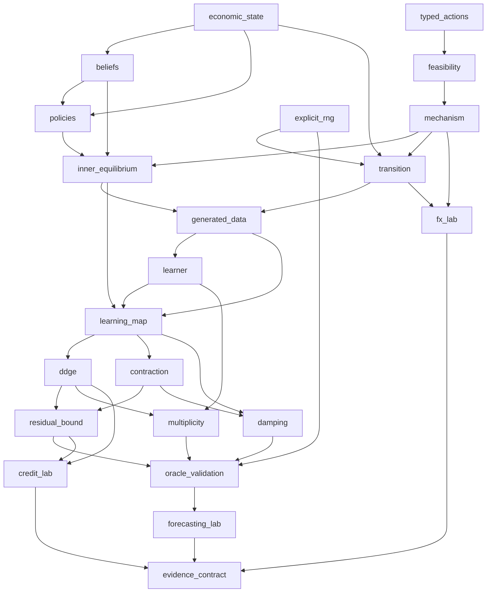

# EWM Foundations Dependency Map

## 1) Scope and Inputs

Inputs are the two local papers, the approved package design, and the formal EWM/DDGE contract.
The map is extracted where a dependency is explicit in the papers and inferred where software
validation introduces an ordering. An edge `A -> B` means that understanding or implementing `A`
is required before `B` can be stated, computed, or validated without hiding a necessary assumption.

## 2) Node Inventory

| id | label | type | source | confidence |
|---|---|---|---|---|
| economic_state | Typed economic state | concept | Han et al. Sec. 2.1 | high |
| typed_actions | Typed joint action profile | concept | Han et al. Sec. 2.2 and 4.2.1 | high |
| feasibility | Feasibility and accounting constraints | concept | Han et al. Sec. 4.2.2 | high |
| explicit_rng | Explicit randomness and provenance | concept | approved design Sec. 4 | high |
| beliefs | Information and belief update | concept | both papers | high |
| policies | Agent objectives and policies | concept | both papers | high |
| mechanism | Market and institutional mechanism | concept | Han et al. Sec. 4.2.2 | high |
| transition | Economic transition and observation kernels | concept | both papers | high |
| inner_equilibrium | Fixed-environment behavioral equilibrium | concept | Cong Sec. 2 and App. B | high |
| generated_data | Endogenous generated-data operator | concept | Cong Sec. 2 | high |
| learner | Learned-component update operator | concept | Cong Sec. 2 | high |
| learning_map | Behavior-data-learning map | concept | Cong Sec. 3 | high |
| ddge | DDGE fixed-point condition | theorem | Cong Definition and Sec. 3 | high |
| contraction | Local contraction and learnability condition | theorem | Cong Sec. 3 and App. A | high |
| residual_bound | A posteriori residual-distance bound | theorem | Cong Corollary A.9 | high |
| multiplicity | Learning-generated multiplicity result | theorem | Cong Theorem 3.5 | high |
| damping | Damped-update stability condition | theorem | Cong App. A.10 | high |
| oracle_validation | Analytical and numerical oracle validation | concept | Cong App. C and approved design | high |
| forecasting_lab | Self-fulfilling forecasting laboratory | concept | Cong App. C.4 | high |
| credit_lab | AI-mediated credit laboratory | concept | Cong App. C.2 | high |
| fx_lab | Multi-agent FX laboratory | concept | Han et al. Sec. 4.2 | medium |
| evidence_contract | Synthetic evidence and claim boundary | concept | approved design Sec. 6 | high |

## 3) Dependency Edge Ledger

| from | to | rationale | confidence |
|---|---|---|---|
| economic_state | beliefs | Belief updates condition on objective and private state. | high |
| economic_state | policies | Policies require a current state on which to act. | high |
| typed_actions | feasibility | Constraints are predicates over submitted actions and state. | high |
| feasibility | mechanism | Only feasible actions may enter the economic mechanism. | high |
| beliefs | policies | Belief-mediated behavior conditions policy decisions. | high |
| policies | inner_equilibrium | Fixed-environment equilibrium requires mutually consistent policies. | high |
| mechanism | transition | Cleared allocations and settlements determine the next economic state. | high |
| economic_state | transition | A transition kernel maps the current state into a successor law. | high |
| explicit_rng | transition | Stochastic transitions require owned and reproducible randomness. | high |
| mechanism | inner_equilibrium | Economic equilibrium includes mechanism and clearing conditions. | high |
| beliefs | inner_equilibrium | Equilibrium includes belief consistency or a declared misspecified analogue. | high |
| transition | generated_data | Generated observations are sampled from induced transitions. | high |
| inner_equilibrium | generated_data | Counterfactual data depend on equilibrium behavior under deployment. | high |
| generated_data | learner | Retraining consumes the endogenously generated dataset. | high |
| learner | learning_map | The outer map applies the learner to induced data. | high |
| generated_data | learning_map | The outer map is indexed by the deployment-induced data law. | high |
| inner_equilibrium | learning_map | Behavior is solved before the induced data and update are computed. | high |
| learning_map | ddge | DDGE is a fixed point of the complete outer map. | high |
| learning_map | contraction | Learnability is diagnosed from the local modulus or Jacobian. | high |
| ddge | residual_bound | Distance bounds are stated relative to a DDGE target. | high |
| contraction | residual_bound | The a posteriori bound needs a modulus strictly below one. | high |
| ddge | multiplicity | Multiplicity concerns the number of fixed points of the DDGE map. | high |
| learner | multiplicity | Learned class and feedback gain can create additional fixed points. | high |
| learning_map | damping | Damping transforms the outer update map and its eigenvalues. | high |
| contraction | damping | Stability analysis supplies the eigenvalue condition for useful damping. | medium |
| residual_bound | oracle_validation | Transparent laboratories compare residual diagnostics with true distances. | high |
| multiplicity | oracle_validation | Oracle cases must recover known fixed-point sets and stability types. | high |
| damping | oracle_validation | Contrarian and complementary cases test the limits of damping. | high |
| oracle_validation | forecasting_lab | The forecasting laboratory verifies roots, bifurcation, and stability. | high |
| ddge | credit_lab | Credit compares frozen deployment with selective and full-information DDGE. | high |
| residual_bound | credit_lab | The credit laboratory tests one-step residual diagnostics. | high |
| mechanism | fx_lab | FX is primarily a mechanism, feasibility, and settlement laboratory. | high |
| transition | fx_lab | Adaptive beliefs and trades must generate an executable market trajectory. | high |
| explicit_rng | oracle_validation | Independent numerical checks require reproducible stochastic experiments. | high |
| forecasting_lab | evidence_contract | Forecasting evidence combines exact roots and stochastic paths. | high |
| credit_lab | evidence_contract | Credit evidence separates oracle truth from counterfactual evaluation. | high |
| fx_lab | evidence_contract | FX evidence separates hard accounting properties from comparative statics. | high |

## 4) Global Dependency Graph

## 5) Layered Learning Order (Topological View)

- `L0`: `economic_state`, `typed_actions`, `explicit_rng`
- `L1`: `beliefs`, `feasibility`
- `L2`: `policies`, `mechanism`
- `L3`: `transition`, `inner_equilibrium`
- `L4`: `generated_data`
- `L5`: `learner`
- `L6`: `learning_map`
- `L7`: `ddge`, `contraction`
- `L8`: `residual_bound`, `multiplicity`, `damping`
- `L9`: `oracle_validation`, `credit_lab`, `fx_lab`
- `L10`: `forecasting_lab`
- `L11`: `evidence_contract`

The graph is acyclic. There are no pedagogical coupling cycles.

## 6) Bottlenecks and Keystone Results

- `inner_equilibrium` is the primary behavioral bottleneck: it unlocks data generation and the
  learning map, and prevents a rollout from being mislabeled an equilibrium.
- `learning_map` is the central DDGE bottleneck: fixed points, stability, damping, and diagnostics
  all depend on its explicit construction.
- `mechanism` is the world-runtime bottleneck: both equilibrium conditions and executable state
  transitions require it.
- `contraction` is the theorem chokepoint for turning residuals into distance statements.
- `oracle_validation` is the evidence chokepoint that prevents implementation success from being
  inferred from convergence alone.

## 7) Minimal Prerequisite Paths

- DDGE: `economic_state -> beliefs -> policies -> inner_equilibrium -> learning_map -> ddge`
- Residual bound: `generated_data -> learner -> learning_map -> contraction -> residual_bound`
- Forecasting laboratory: `learning_map -> ddge -> multiplicity -> oracle_validation -> forecasting_lab`
- Credit laboratory: `inner_equilibrium -> generated_data -> learning_map -> ddge -> credit_lab`
- FX laboratory: `typed_actions -> feasibility -> mechanism -> transition -> fx_lab`

## 8) Ambiguities and Alternative Edges

- `contraction -> damping` is medium confidence. Damping can be defined without contraction, but
  the useful stabilizability statement requires local eigenvalue analysis. An alternative ordering puts
  both directly after `learning_map` with no edge between them.
- The FX example in Han et al. is an implementation protocol, not a complete calibrated economic
  model. `transition -> fx_lab` is therefore partly inferred from the approved laboratory design.
- Belief consistency can be replaced by a declared misspecified best-response notion. An alternative
  map would split `beliefs` into Bayesian consistency and Berk-Nash best-in-class consistency.
- Full correspondence theory could precede `inner_equilibrium`; version 0.1 instead implements a
  single-valued protocol plus multistart discovery and records this limitation explicitly.

## 9) Study Plans From the Map

- Theory-first: follow `L0` through `L8`, then validate forecasting before studying credit or FX.
- Runtime-first: study `typed_actions -> feasibility -> mechanism -> transition -> fx_lab`, then
  connect the runtime to `inner_equilibrium` and the DDGE layers.
- Evidence-first: begin with `evidence_contract`, trace prerequisites backward in the HTML viewer,
  then implement the three minimal paths in section 7.

## 10) Sanity Check Summary

The map contains 22 nodes, 37 edges, 12 learning layers, and zero cycle clusters. Its shape has two
early branches: executable economic closure and behavior-data-learning closure. They meet at the
inner equilibrium and transition-induced data law, after which the learning map becomes the shared
bottleneck for DDGE, stability, and diagnostics. The three laboratories terminate in one evidence
contract but test different parts of the dependency structure.
